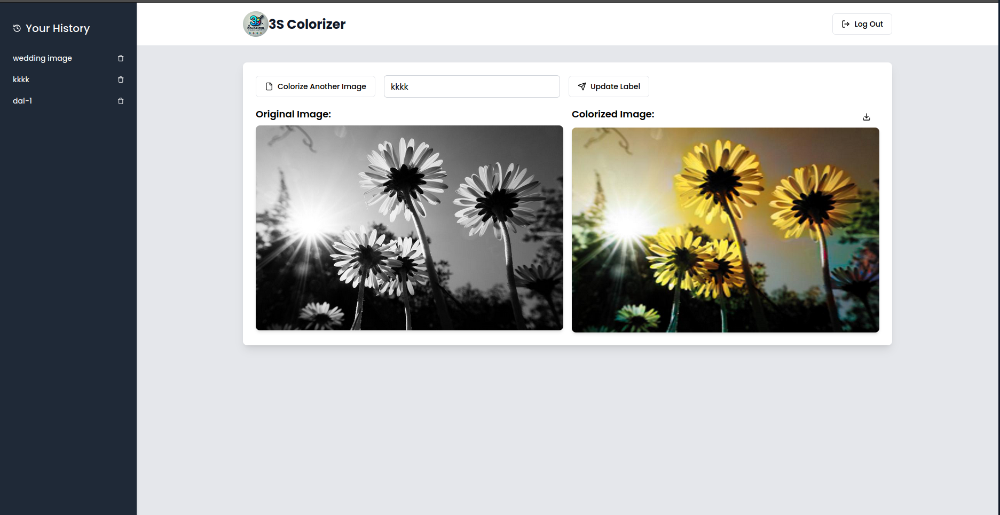
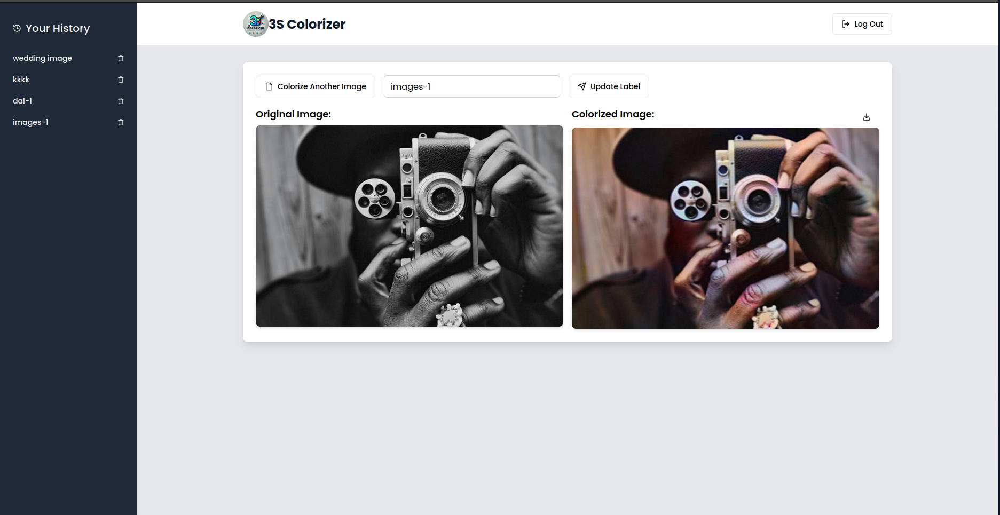

# Image Colorization using AI → [Tutorial](./tutorial) 

## Overview
This project focuses on converting black-and-white images into vibrant color using an AI-driven approach. The system utilizes a convolutional neural network (CNN) based autoencoder and a conditional Generative Adversarial Network (cGAN) to generate realistic colorized images.

## Folder Structure
```
minor-project/
│── model/           # Contains AI models and training scripts
│── minor-backend/   # Backend (Node and Express, MongoDB, authentication, and APIs)
│── minor/           # Frontend (React.TS, Tailwind CSS, Vite)
```

## Features
- **User Authentication**: Secure login and signup system to record user-specific data.
- **AI Model**: 
  - Encoder: ResNet-based feature extraction.
  - Decoder: Custom-built architecture.
  - cGAN Model: Includes a generator and discriminator for improved colorization quality.
- **Data Processing**: Preprocessing pipeline to handle grayscale image input and prepare it for training.
- **Training & Evaluation**: 
  - Implements an autoencoder and cGAN for colorization.
  - Utilizes Optuna for hyperparameter tuning.
  - Returns both training and testing loss metrics.
- **Storage Management**: Stores both original and colorized images in a database.
  - Automatically deletes grayscale images if an error occurs during colorization.

## Tech Stack
- **Frontend**: React.TS, Tailwind CSS, Vite, TypeScript
- **Backend**: Node and Express, MongoDB
- **AI Frameworks**: PyTorch, scikit-image
- **Authentication**: JWT-based system

## Installation
### Prerequisites
Ensure you have the following installed:
- Node.js & npm
- Python (with PyTorch, scikit-image, and Optuna)
- MongoDB
- EXPRESSJS (for backend API)

### Steps
1. Clone the repository:
   ```sh
   git clone https://github.com/your-repo/image-colorization.git
   cd image-colorization
   ```
2. Install dependencies in each folder:
   ```sh
   cd minor
   npm install
   cd ../minor-backend
   npm install
   ```
3. Start the frontend:
   ```sh
   cd ../minor
   npm run dev
   ```
4. Set up the backend:
   - Configure the `.env` file for database credentials.
   - Start the Node and Express backend server.
5. Run the AI model:
   ```sh
   cd ../model
   python app.py  # Train the model
   ```

## Usage
- Users can upload a grayscale image.
- The system processes the image and returns a colorized version.
- Users can download the output or compare with the original.

## Future Enhancements
- Improve the cGAN model for better color accuracy.
- Add real-time image preview during colorization.
- Deploy as a cloud-based web application.

## Contributors
- Subash Kumar Yadav [LinkedIn](https://www.linkedin.com/in/subash-kumar-yadav/)
- Ritesh Sahani  [LinkedIn](https://www.linkedin.com/in/ritesh-sahani-548a4219a/)
- Md. Astafar Alam [LinkedIn](https://www.linkedin.com/in/md-astafar-alam-b00985307/)
- Reshmi Jha [LinkedIn](https://www.linkedin.com/in/reshmijha023/)

## Samples




# 📘 Tutorials Dashboard

<details open>
<summary><b>📑 Chapters</b></summary>
0. [Overview](./tutorial/README.md)
1. [Frontend Application Structure](./tutorial/01_frontend_application_structure_.md)  
2. [User Authentication System](./tutorial/02_user_authentication_system_.md)  
3. [Image Colorization Service](./tutorial/03_image_colorization_service_.md)  
4. [Image History Management](./tutorial/04_image_history_management_.md)  
5. [Deep Learning Colorization Model](./tutorial/05_deep_learning_colorization_model_.md)  

</details>

---

## 📖 Content

Welcome to the **Tutorials section** 🎯  

Here’s what you’ll learn:  

- **Chapter 1: Frontend Application Structure** → Understand how the frontend is organized.  
- **Chapter 2: User Authentication System** → Learn about login, registration, and security.  
- **Chapter 3: Image Colorization Service** → Explore how the service works.  
- **Chapter 4: Image History Management** → Manage and track previously colorized images.  
- **Chapter 5: Deep Learning Colorization Model** → Dive into the AI model powering colorization.  

👉 Start with **[Overview](./tutorial/README.md)** 🚀

