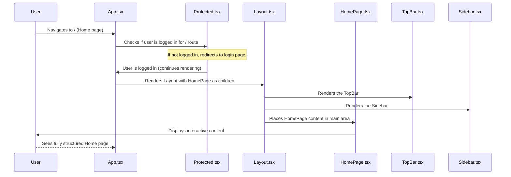

# Chapter 1: Frontend Application Structure

Welcome to the **minor-project** tutorial! In this first chapter, we're going to explore the foundational "Frontend Application Structure." Think of this as the blueprint for our entire application's user interface (UI). Just like a building needs a well-thought-out architectural plan before construction begins, our app needs a clear structure to ensure everything is organized, easy to find, and looks consistent.

### Why Structure Matters

Imagine trying to navigate a building where every room is a different shape, doors are in random places, and there are no signs! It would be confusing and frustrating. The same goes for an application. A good frontend structure provides:

*   **Consistency**: Every part of the app feels familiar. The navigation always looks the same, buttons are in predictable places, and the overall style is cohesive.
*   **Ease of Navigation**: Users can quickly find what they need without getting lost.
*   **Maintainability**: As developers, it's easier for us to add new features or fix issues when the code is logically organized.

Our central use case for this chapter is: **How do we build the user interface for our image colorization app so that it is organized, easy to navigate, and consistent across different sections?** We want a clear layout with a top bar, a side menu, and a main area where the "magic" (like image colorization) happens.

Let's break down how we achieve this!

### Key Components of Our Application's Look

Our `minor-project` application's structure is designed with three main visual areas:

1.  **Main Content Area**: This is where the actual work happens – like uploading an image, seeing the colorized result, or managing your history. Each "page" of our application will display its unique content here.
2.  **Persistent Top Navigation Bar**: This bar always stays at the top of the screen. It usually contains the app's logo, title, and important actions like logging out.
3.  **Collapsible Sidebar**: This is a menu that can slide in and out from the side of the screen. It's perfect for less frequently accessed navigation items or features, like viewing your image history.

These components work together to create a unified and intuitive user experience.

### The Application's Entry Point: `App.tsx`

In our project, the `App.tsx` file acts like the central "control room" of our application. It uses a library called `react-router-dom` to decide which "room" (or page) of our application the user should see based on the web address (URL).

Here’s a simplified look at `App.tsx`:

```typescript
// Minor/src/App.tsx
import { BrowserRouter as Router, Routes, Route } from "react-router-dom";
import { HomePage, LoginPage } from "./pages"; // Our application pages
import Protected from "./utils/protect/Protected"; // Helps secure routes

const App = () => {
  return (
    <Router> {/* The brain for managing web addresses */}
      <Routes> {/* Defines different paths (web addresses) */}
        <Route path="/login" element={<LoginPage />} /> {/* Path for Login page */}
        <Route path="/signup" element={<SignupPage />} /> {/* Path for Signup page */}
        
        {/* The '/' path (our Home page) is wrapped by 'Protected' */}
        <Route element={<Protected />}>
          <Route path="/" element={<HomePage />} />
        </Route>
      </Routes>
    </Router>
  );
};

export default App;
```

**Explanation**:

*   `BrowserRouter as Router`: This component from `react-router-dom` watches the web address in your browser and helps change what's shown on the screen.
*   `Routes`: This component contains all the possible paths (URLs) your application can go to.
*   `Route`: Each `<Route>` defines a specific path and which "element" (a page component) should be displayed when that path is active.
    *   For example, if you go to `your-app.com/login`, the `<LoginPage />` will be shown.
*   `element={<Protected />}`: This is a special wrapper. It means that before you can see the `<HomePage />`, the `Protected` component will first check if you are logged in. We'll dive deeper into how this security system works in [Chapter 2: User Authentication System](02_user_authentication_system_.md).

### The Reusable Layout: `Layout.tsx`

Many pages in our application will share the same top bar and sidebar. Instead of adding these components to every single page, we create a `Layout` component. This component acts as a reusable "template" or "frame" for our pages.

```typescript
// Minor/src/components/Layout.tsx
import React from 'react';
import TopBar from './Topbar'; // Our top navigation bar
import Sidebar from './Sidebar'; // Our collapsible side menu

interface LayoutProps {
  children: React.ReactNode; // This will be the unique content of each page
}

const Layout: React.FC<LayoutProps> = ({ children }) => {
  // We use state to control if the sidebar is open or closed
  const [isSidebarOpen, setIsSidebarOpen] = React.useState(false);

  return (
    <div className="flex h-screen bg-gray-100"> {/* Main container, fills the screen */}
      <Sidebar isSidebar={isSidebarOpen} setSidebar={setIsSidebarOpen} /> {/* The sidebar */}
      <div className="flex flex-col flex-1 overflow-hidden"> {/* Content area next to sidebar */}
        <TopBar setSideBar={setIsSidebarOpen} /> {/* The top bar */}
        <main className="flex-1 overflow-y-auto bg-gray-200"> {/* Main content area */}
          {children} {/* This is where YOUR page content goes! */}
        </main>
      </div>
    </div>
  );
};

export default Layout;
```

**Explanation**:

*   `LayoutProps` and `children`: The `children` prop is a special React feature. It allows you to "wrap" other components with `Layout`. Whatever you put inside `<Layout>` tags will be shown where `{children}` is placed.
*   `useState(false)`: This is how we keep track of whether the sidebar is currently open (`true`) or closed (`false`). When the `setSidebar` function is called (e.g., by clicking a button in `TopBar`), it updates this state, which then tells the `Sidebar` to open or close.
*   `TopBar` and `Sidebar`: These are simply other components that we include directly within our `Layout` to provide the consistent navigation elements.

### The Top Navigation Bar: `Topbar.tsx`

This component is responsible for the persistent bar at the top of our application. It's always visible and provides key elements like our app's branding and a way to log out. On smaller screens, it also provides a button to open the sidebar.

```typescript
// Minor/src/components/Topbar.tsx
import React from 'react';
import { Button } from './button'; // A custom button component
import { LogOut, SidebarOpen } from 'lucide-react'; // Icons

interface TopBarProps {
  setSideBar: (value: boolean) => void; // Function to open/close sidebar
}

const TopBar: React.FC<TopBarProps> = ({ setSideBar }) => {
  return (
    <header className="bg-white shadow-md">
      <div className="max-w-7xl mx-auto px-4 py-4 flex justify-between items-center">
        <div className='flex items-center'>
          
          <h1 className="text-2xl font-bold hidden text-gray-900 sm:block">3S Colorizer</h1>
        </div>
        {/* Button to open the sidebar (only visible on small screens) */}
        <Button variant="outline" onClick={() => setSideBar(prev => !prev)} className='sm:hidden'>
          <SidebarOpen className='h-4 w-4' />
        </Button>
        {/* Button to log out */}
        <Button variant="outline">
          <LogOut className='sm:mr-2 h-4 w-4' />
          <span className='hidden sm:block'>Log Out</span>
        </Button>
      </div>
    </header>
  );
};

export default TopBar;
```

**Explanation**:

*   `setSideBar`: This prop is a function passed down from `Layout`. When the small `SidebarOpen` button is clicked, it calls `setSideBar` to toggle the sidebar's visibility.
*   Branding: The `img` and `h1` elements display our application's logo and name.
*   Logout Button: A standard button for user logout functionality (the actual logic for logging out is handled elsewhere, which we'll discuss in [Chapter 2: User Authentication System](02_user_authentication_system_.md)).

### The Collapsible Sidebar: `Sidebar.tsx`

The `Sidebar` component provides a navigation menu that can be hidden or shown. In our application, it's used to display a user's image history, allowing quick access to previously colorized images.

```typescript
// Minor/src/components/Sidebar.tsx
import React from 'react';
import { Button } from './button'; // Our custom button component
import { History, SidebarClose, Trash } from 'lucide-react'; // Icons

interface SidebarProps {
  isSidebar: boolean; // Tells us if the sidebar should be visible
  setSidebar: (value: boolean) => void; // Function to change sidebar visibility
}

const Sidebar: React.FC<SidebarProps> = ({ isSidebar, setSidebar }) => {
  return (
    <div
      // This line controls the sidebar's appearance based on 'isSidebar' prop
      className={`bg-gray-800 text-white w-64 h-[100vh] absolute transform -translate-x-full md:relative md:translate-x-0 transition duration-200 ease-in-out ${isSidebar ? 'translate-x-0' : '-translate-x-full'}`}
    >
      <nav>
        {/* "Your History" title button */}
        <Button variant="ghost" className="w-full justify-start text-white">
          <History className="mr-2 h-4 w-4" /> Your History
        </Button>

        {/* Example: A button for a history item */}
        <Button className="w-full text-sm rounded-md py-2 px-4 text-left">
           <span className="truncate w-[35ch]">My Awesome Image Label</span>
           <Trash className='w-5 h-5 hover:text-red-700' />
        </Button>

        {/* Button to close sidebar (only visible on small screens) */}
        <Button onClick={() => setSidebar(false)} className="absolute top-0 right-2 sm:hidden">
          <SidebarClose className="h-4 w-4" />
        </Button>
      </nav>
    </div>
  );
};

export default Sidebar;
```

**Explanation**:

*   `isSidebar` prop: This boolean (`true` or `false`) determines whether the sidebar is currently visible. The `className` uses this prop to apply CSS styles that slide the sidebar into or out of view.
*   `setSidebar` prop: Similar to `TopBar`, this function (passed from `Layout`) allows the `Sidebar` to tell `Layout` when it wants to change its visibility (e.g., when the `SidebarClose` button is clicked or a click outside is detected).
*   History Items: This is where we would list previous image colorization tasks, allowing users to revisit them.

### How Pages Fit In: `HomePage.tsx`

Now that we have our `Layout` component, using it is simple! Any page that needs the consistent top bar and sidebar simply "wraps" its unique content with the `Layout` component.

Here's how our `HomePage.tsx` uses it:

```typescript
// Minor/src/pages/Home.tsx
import Layout from '../components/Layout'; // Import our reusable layout

export default function Home() {
  return (
    <Layout> {/* We wrap all our HomePage content with the Layout */}
      <div className="max-w-7xl mx-auto px-4 sm:px-6 lg:px-8 py-8">
        <div className="bg-white shadow-lg rounded-lg p-6">
          {/* All the unique parts of the Home page go here */}
          <h1>Welcome to 3S Colorizer!</h1>
          <p>Upload an image to colorize it. You can see your history in the sidebar!</p>
          {/* ... all the image upload and display features ... */}
        </div>
      </div>
    </Layout>
  );
}
```

**Explanation**:

*   By placing `<div ...>...</div>` inside `<Layout>...</Layout>`, all the unique elements and functionality of the `HomePage` are rendered within the `main` content area defined by `Layout.tsx`. This ensures that `TopBar` and `Sidebar` are always present, giving our app a consistent look and feel.

### Under the Hood: How a Page is Displayed

Let's trace what happens from the moment you type your application's address (like `your-app.com/`) into your browser:



1.  **User Navigates**: You open your browser and go to the application's main address (e.g., `your-app.com`).
2.  **`App.tsx` Takes Control**: The `App.tsx` file, our application's "router," sees that the path is `/`.
3.  **Security Check**: `App.tsx` directs this request to the `Protected` component. This component's job is to ensure you're logged in before showing you the sensitive content of the `HomePage`. If you're not logged in, it will send you to the login page.
4.  **Layout Renders**: Since you are logged in, `App.tsx` tells `Layout.tsx` to display.
5.  **Components within Layout**: `Layout.tsx` then takes over. It creates the main screen structure and renders its own children components:
    *   It renders the `TopBar` at the top.
    *   It renders the `Sidebar` on the left (which can be hidden or shown).
6.  **Page Content Appears**: Finally, `Layout.tsx` takes the `HomePage` component (which it received as `children`) and places its unique content within the main content area.
7.  **User Sees the App**: The browser displays the complete page, with the `TopBar`, `Sidebar`, and the specific content of the `HomePage` all working together seamlessly.

### Conclusion

In this chapter, we learned about the essential "Frontend Application Structure" of our `minor-project`. We explored how `App.tsx` acts as the routing brain, directing users to different pages. We then saw how `Layout.tsx` provides a consistent "wrapper" for our pages, incorporating common elements like the `TopBar` and `Sidebar`. This architectural plan ensures our application is organized, user-friendly, and easy to expand.

Now that we understand the overall structure, in the next chapter, we'll dive into the important aspect of securing our application: the [User Authentication System](02_user_authentication_system_.md).

---
