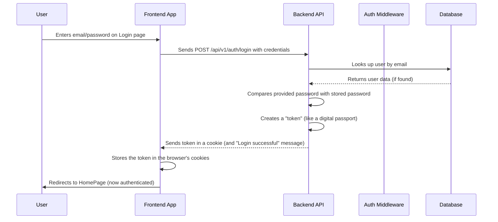

# Chapter 2: User Authentication System

Welcome back to the **minor-project** tutorial! In [Chapter 1: Frontend Application Structure](01_frontend_application_structure_.md), we laid out the visual blueprint of our application, including a special `Protected` component. We hinted that this component acts as a security check, ensuring only authorized users can see certain pages. In this chapter, we're going to dive deep into how that security check, and indeed all user-related interactions, actually work: through our "User Authentication System."

### Why User Authentication Matters

Imagine you're using a photo editing app. You upload your favorite pictures, apply cool effects, and save them. If anyone could just open the app and see *your* photos, that wouldn't feel very private or secure, right? This is where a **User Authentication System** comes in.

It's like the bouncer at the entrance of a club:

*   It **identifies** who you are (Are you John Doe?).
*   It **verifies** that you are who you say you are (Prove it, John Doe!).
*   It **grants access** to the right areas based on your identity (Okay, John, you can go to the VIP section where your photos are).

Our central use case for this chapter is: **How does our image colorization app identify users, allow them to sign up, log in, and ensure only they can access their personal features like their image history?** We want to make sure only *you* can see *your* colorized images, and not someone else's.

Let's break down how we achieve this!

### Key Concepts of Our Authentication System

Our `minor-project`'s authentication system handles a few main tasks:

1.  **Registration (Sign Up):** This is for new users to create an account by providing an email and password. Think of it as getting a new membership card.
2.  **Login (Sign In):** For existing users to prove their identity (usually with email and password) to gain access to the application. This is like showing your membership card to the bouncer.
3.  **Secure Session Management:** Once you're logged in, the system needs to remember you as you move around the app, without you having to log in on every page. This is like the bouncer remembering your face after you've shown your card once.
4.  **Third-Party Logins (Social Login):** For convenience, users can sign up or log in using accounts they already have, like Google, Discord, or Facebook. This is like using a universally accepted ID instead of a special club card.

### How You Interact With the System (Frontend)

From a user's perspective, the authentication system starts with the **Login** and **Sign Up** pages.

#### 1. The Login Page (`Login.tsx`)

This is where users enter their email and password.

```typescript
// Minor/src/pages/Login.tsx
// ... (imports) ...
import {handleLogin} from "../utils/api/Fetcher"; // Our special function to handle login

export default function LoginPage() {
  const [email, setEmail] = useState('');
  const [password, setPassword] = useState('');
  const navigate = useNavigate(); // Used to change pages

  const handleSubmit = async (e: React.FormEvent) => {
    e.preventDefault();
    // Calls our login function which talks to the backend
    handleLogin(email, password, navigate); 
  };

  return (
    <div className="flex items-center justify-center min-h-screen bg-gray-100">
      <Card className="w-full max-w-md">
        <CardHeader>
          <CardTitle>Login</CardTitle>
          <CardDescription>Enter your credentials to access your account</CardDescription>
        </CardHeader>
        <CardContent>
          <form onSubmit={handleSubmit}>
            <Input id="email" type="email" value={email} onChange={(e) => setEmail(e.target.value)} />
            <Input id="password" type="password" value={password} onChange={(e) => setPassword(e.target.value)} />
            <Button className="w-full mt-6" type="submit">Log in</Button>
          </form>
        </CardContent>
        <CardFooter>
          <p>Don't have an account? <Link to="/signup">Sign up</Link></p>
        </CardFooter>
      </Card>
    </div>
  );
}
```

**Explanation:**
*   This page collects the `email` and `password` the user types in.
*   When the "Log in" button is clicked, it calls a special function called `handleLogin` (which we'll explore shortly). This function sends the user's information to our application's "brain" (the backend) to verify it.
*   If the login is successful, `navigate('/')` will take the user to the `HomePage` (our main application area).

#### 2. The Sign Up Page (`Signup.tsx`)

This page allows new users to create an account.

```typescript
// Minor/src/pages/SingUp.tsx
// ... (imports) ...
import {handleGoogleLogin} from "../utils/api/Fetcher"; // For social logins

export default function SignupPage() {
  const [email, setEmail] = useState('');
  const [password, setPassword] = useState('');
  const [fullname, setFullName] = useState('');
  const navigate = useNavigate();

  const handleSubmit = async (e: React.FormEvent) => {
    e.preventDefault();
    // This part sends user data to the backend to create a new account
    axios.post(`${import.meta.env.VITE_BASE_URL}/api/v1/auth/signup`, {
      email, password, fullname
    }).then(res => {
      if(res.status === 201) {
        toast.success('Signup successful');
        navigate('/'); // Go to home page after signing up
      }
    });
  };

  const handleSocialSignup = (provider: string) => {
    if(provider === 'Google'){
      handleGoogleLogin(); // Calls function to start Google login process
    }
    // ... similar calls for Discord and Facebook ...
  };

  return (
    <div className="flex items-center justify-center min-h-screen">
      <Card>
        <CardHeader><CardTitle>Sign Up</CardTitle></CardHeader>
        <CardContent>
          {/* Social Login Buttons */}
          <IconButton icon={<GoogleIcon />} onClick={() => handleSocialSignup('Google')} />
          {/* ... other social buttons ... */}
          <Divider>Or</Divider>
          <form onSubmit={handleSubmit}>
            <Input id="fullname" value={fullname} onChange={(e) => setFullName(e.target.value)} />
            <Input id="email" value={email} onChange={(e) => setEmail(e.target.value)} />
            <Input id="password" type="password" value={password} onChange={(e) => setPassword(e.target.value)} />
            <Button type="submit">Sign up</Button>
          </form>
        </CardContent>
      </Card>
    </div>
  );
}
```

**Explanation:**
*   Users can fill in their `fullname`, `email`, and `password`. When they click "Sign up," this information is sent to the backend to create a new user entry.
*   Notice the `IconButton`s for social logins. When clicked, functions like `handleGoogleLogin()` are called, which redirect the user to Google (or Discord/Facebook) to handle the login there. After a successful social login, they are sent back to our app, already logged in.

#### 3. Protecting Pages (`Protected.tsx`)

From [Chapter 1](01_frontend_application_structure_.md), you know `Protected.tsx` is crucial. It acts as our application's doorman, checking if you're allowed inside.

```typescript
// Minor/src/utils/protect/Protected.tsx
import { Outlet, useNavigate } from "react-router-dom";
import { useEffect, useState } from "react";
import { handlerRedirect } from "../api/Fetcher"; // Our function to check login status

const Protected = () => {
    const navigate = useNavigate();
    const [isLoggedIn, setIsLoggedIn] = useState<boolean | null>(null);

    useEffect(() => {
        const checkAuth = async () => {
            const res = await handlerRedirect(); // Ask the backend: "Am I logged in?"
            setIsLoggedIn(res); // Update our state based on the answer
        };
        checkAuth();
    }, []); // Run this check only once when the page loads

    useEffect(() => {
        if (isLoggedIn === false) {
            // If the backend says "No, you're not logged in!", send them to the login page.
            navigate("/login");
        }
    }, [isLoggedIn, navigate]);

    // If still checking (null) or logged in (true), show the page. Otherwise, show nothing.
    return isLoggedIn ? <Outlet /> : null;
};

export default Protected;
```

**Explanation:**
*   When a "protected" page (like our `HomePage`) is accessed, `Protected.tsx` is called first.
*   It immediately asks the backend if the user is logged in using `handlerRedirect()`.
*   If the backend responds "no" (`isLoggedIn` becomes `false`), `Protected.tsx` quickly redirects the user to the `/login` page.
*   If the backend says "yes" (`isLoggedIn` is `true`), then `Protected.tsx` allows the actual `HomePage` content to be displayed using `<Outlet />`.

#### 4. Logging Out (`Topbar.tsx` / `Fetcher.tsx`)

The "Log Out" button you saw in the `TopBar` in [Chapter 1](01_frontend_application_structure_.md) is connected to a function that tells our system to end your session.

```typescript
// Minor/src/components/Topbar.tsx
// ... (imports) ...
import { LogOut } from 'lucide-react';
import { handleLogout } from '../utils/api/Fetcher'; // Our logout function

const TopBar: React.FC<TopBarProps> = ({ setSideBar }) => {
  const navigate = useNavigate();
  return (
    <header className="bg-white shadow-md">
      <div className="flex justify-between items-center">
        {/* ... app branding ... */}
        <Button variant="outline" onClick={() => handleLogout(navigate)}> {/* Call handleLogout when clicked */}
          <LogOut className='sm:mr-2 h-4 w-4' />
          <span className='hidden sm:block'>Log Out</span>
        </Button>
      </div>
    </header>
  );
};
```

**Explanation:**
*   When the "Log Out" button is clicked, it calls `handleLogout` from our `Fetcher.tsx` file.
*   `handleLogout` sends a request to the backend to clear the user's session information, effectively logging them out. The user is then redirected to the login page.

### Under the Hood: How it All Works (Backend)

Now, let's peek behind the curtain and see how our backend (the "brain" of our application) handles these authentication requests.

#### High-Level Login Flow

Let's trace what happens when a user logs in with their email and password:



#### Key Backend Components

1.  **Fetcher (`Fetcher.tsx` - Frontend Helper):**
    This file acts like our frontend's messenger, containing functions that talk to the backend.

    ```typescript
    // Minor/src/utils/api/Fetcher.tsx
    import axios from "axios"; // Tool to make network requests

    export const handleLogin = (email: string, password: string, navigate: (path: string) => void) => {
        axios.post(`${import.meta.env.VITE_BASE_URL}/api/v1/auth/login`, {
            email, password
        }, {
            withCredentials: true // Important: sends/receives cookies
        }).then(res => {
            if(res.status === 200) {
                navigate('/'); // Redirect on success
                toast.success('Login successful');
            }
        }).catch(err => {
            // ... error handling ...
        });
    };

    export const handlerRedirect = async () => {
        try {
            const response = await axios.get(`${import.meta.env.VITE_BASE_URL}/api/v1/auth/go-home`, {
                withCredentials: true,
            });
            return response.status === 200 && response.data.status === true;
        } catch (error) {
            return false; // Not authenticated on error
        }
    };

    export const handleLogout = (navigate: (path: string) => void) => {
        axios.get(`${import.meta.env.VITE_BASE_URL}/api/v1/auth/logout`, {
            withCredentials: true
        }).then(res => {
            if(res.status === 200) {
                navigate('/login'); // Redirect to login after logout
                toast.success('Logout successful');
            }
        });
    };
    // ... social login handlers ...
    ```

    **Explanation:**
    *   `axios`: This is a library that helps our frontend send and receive data from the backend over the internet.
    *   `handleLogin`, `handlerRedirect`, `handleLogout`: These functions are wrappers around `axios` calls that simplify talking to specific backend authentication points.
    *   `withCredentials: true`: This very important setting tells the browser to automatically send any "cookies" (small pieces of data stored by the website) along with the request, and also to accept new cookies from the server. Our authentication "token" is stored in a cookie!

2.  **Authentication Routes (`auth.route.ts` - Backend Entry Points):**
    These routes are like specific addresses in our backend for authentication tasks.

    ```typescript
    // minor-backend/src/route/auth.route.ts
    import { Router } from "express";
    import { login, signup, logout, authondicateTohome } from '../controllers/auth.controller';
    import { authenticate } from "../middleware/authondicate"; // Our bouncer middleware

    const router = Router();

    router.post("/signup", signup); // When user wants to sign up
    router.post("/login", login);   // When user wants to log in

    // Routes for social logins
    router.get("/google", googleController);
    router.get("/google/callback", googleCallback);
    // ... discord and facebook routes ...

    router.get("/go-home", authenticate, authondicateTohome); // Check if authenticated
    router.get("/logout", authenticate, logout);             // Log out

    export default router;
    ```

    **Explanation:**
    *   Each `router.post` or `router.get` defines an "endpoint" or "address" that the frontend can send requests to.
    *   `authenticate`: Notice that `go-home` and `logout` have `authenticate` listed before their main function. This means the `authenticate` middleware (our bouncer) will run *first* to check the user's token before proceeding.

3.  **Authentication Controllers (`auth.controller.ts` - Backend Logic):**
    These functions contain the actual "recipes" for handling authentication requests.

    ```typescript
    // minor-backend/src/controllers/auth.controller.ts
    import { Request, Response } from 'express';
    import {compare, hashPassword} from '../utils/bcrypt'; // For secure passwords
    import User from '../models/User'; // Our user data structure
    import jwt from 'jsonwebtoken'; // For creating digital passports (tokens)

    const signup = async (req: Request, res: Response): Promise<void> => {
      const { email, password, fullname } = req.body;
      const existingUser = await User.findOne({ email }); // Check if email already exists
      if (existingUser) { res.status(400).json({ message: 'User exists' }); return; }

      const hashedPassword = await hashPassword(password); // Make password unreadable
      const newUser = new User({ fullname, email, password: hashedPassword });
      await newUser.save(); // Save new user to database

      const token = jwt.sign({ userId: newUser._id, email : newUser.email }, process.env.JWT_SECRET as string, { expiresIn: '3d' });
      res.cookie('token', token, { httpOnly: false, secure: true, maxAge: 3*24*3600*1000, sameSite: 'none' }); // Give token to browser
      res.status(201).json({ message: 'User created successfully' });
    };

    const login = async (req: Request, res: Response): Promise<void> => {
      const { email, password } = req.body;
      const existingUser = await User.findOne({email}); // Find user in database
      if(!existingUser) { res.status(400).json({message: 'Invalid credentials'}); return; }

      const passwordMatch = await compare(password, existingUser.password); // Check password
      if(!passwordMatch) { res.status(400).json({message: 'Invalid credentials'}); return; }

      const token = jwt.sign({userId: existingUser._id, email: existingUser.email}, process.env.JWT_SECRET as string, { expiresIn: '3d' });
      res.cookie('token', token, { httpOnly: false, secure: true, maxAge: 3*24*3600*1000, sameSite: 'none' }); // Set token
      res.status(200).json({message: 'Login successful'});
    };

    const authondicateTohome = async (req: Request, res: Response): Promise<void> => {
      // If we reach here, 'authenticate' middleware already verified the token!
      const user = req.user; // User information is added to 'req.user' by the middleware
      if(user) { res.status(200).json({status:true}); } else { res.status(400).json({status:false}); }
    };

    const logout = async (req: Request, res: Response): Promise<void> => {
      res.clearCookie('token'); // Remove the token from the browser
      res.status(200).json({message: 'Logout successful'});
    };
    // ... (export functions) ...
    ```

    **Explanation:**
    *   `hashPassword` and `compare`: These are functions that use `bcrypt` to encrypt passwords (so they are not stored in plain text) and securely compare them during login. This is a crucial security step!
    *   `jwt.sign`: This creates a **JSON Web Token (JWT)**, which is like a tamper-proof digital passport. It contains basic user info (like `userId`, `email`) and is signed with a secret key, so the backend can verify it later.
    *   `res.cookie('token', token, ...)`: This sends the JWT back to the user's browser and tells it to store it as a "cookie." This cookie will then be automatically sent with future requests to our backend.
    *   `req.user`: When a request comes in and the `authenticate` middleware (next section) successfully verifies the token, it adds the user's information to `req.user`. This allows later functions, like `authondicateTohome`, to easily know who the current user is.

4.  **User Model (`User.ts` - Database Blueprint):**
    This file defines the structure of how user data (like full name, email, and password) is stored in our database.

    ```typescript
    // minor-backend/src/models/User.ts
    import mongoose, { Document, Schema } from 'mongoose';

    interface IUser extends Document {
      fullname: string;
      email: string;
      password: string;
    }

    const UserSchema: Schema<IUser> = new Schema(
      {
        fullname: { type: String, required: true },
        email: { type: String, required: true, unique: true },
        password: { type: String, required: true, minlength: 6 },
      },
      { timestamps: true } // Adds 'createdAt' and 'updatedAt' automatically
    );

    const User = mongoose.model<IUser>('User', UserSchema);
    export default User;
    ```

    **Explanation:**
    *   This defines what a "User" looks like in our database: `fullname`, `email` (which must be unique), and `password`.
    *   `mongoose` is a tool that helps us easily interact with our database.

5.  **Authentication Middleware (`authondicate.ts` - The Bouncer):**
    This is the "bouncer" code. It runs before certain routes to check if the user is logged in.

    ```typescript
    // minor-backend/src/middleware/authondicate.ts
    import { Request, Response, NextFunction } from 'express';
    import jwt from 'jsonwebtoken'; // To verify digital passports

    // We tell TypeScript that our Request can now have a 'user' property
    declare module 'express-serve-static-core' {
      interface Request { user?: { userId: string; email: string; fullname: string; }; }
    }

    const authenticate = (req: Request, res: Response, next: NextFunction): void => {
      const token = req.cookies.token; // Get the digital passport from the browser's cookies

      if (!token) {
        res.status(401).json({ message: 'Authentication failed. No token provided.' });
        return;
      }

      try {
        const decoded = jwt.verify(token, process.env.JWT_SECRET as string); // Check if passport is valid
        req.user = decoded as typeof req.user; // Attach user info to the request for later use
        next(); // User is authenticated, proceed to the next step (e.g., the controller function)
      } catch (error) {
        res.status(401).json({ message: 'Authentication failed. Invalid token.' }); // Invalid passport!
      }
    };
    export { authenticate };
    ```

    **Explanation:**
    *   This function runs for any request that includes `authenticate` in its route definition (like `/go-home` or `/logout`).
    *   It looks for the `token` cookie that the backend previously sent.
    *   `jwt.verify`: This checks if the JWT is valid (not tampered with, not expired) using the same secret key that was used to sign it.
    *   `req.user = decoded`: If the token is valid, it extracts the user's information from the token and adds it to the `req.user` object. This way, subsequent parts of the backend can easily know which user made the request without looking up the database every time.
    *   `next()`: If the user is authenticated, this tells Express to continue to the next function in the route (e.g., `authondicateTohome`). If not, it sends a `401 Unauthorized` error.

6.  **Social Login Strategies (e.g., `google.strategies.ts`):**
    These files (like `discord.strategies.ts`, `facebook.strategies.ts`) define how our backend talks to third-party services like Google, Discord, and Facebook. They use a library called `passport.js`.

    ```typescript
    // minor-backend/src/strategies/google.strategies.ts
    import jwt from 'jsonwebtoken';
    import { Strategy as GoogleStrategy } from 'passport-google-oauth2';
    import passport from 'passport';
    import User from '../models/User'; // Our user data blueprint
    import { hashPassword } from '../utils/bcrypt';

    export default passport.use(
        new GoogleStrategy(
            {
                clientID: process.env.GOOGLE_CLIENT_ID as string,
                clientSecret: process.env.GOOGLE_CLIENT_SECRET as string,
                callbackURL: "http://localhost:5000/api/v1/auth/google/callback",
                passReqToCallback: true,
            },
            async (request: any, accessToken: string, refreshToken: string, profile: any, done: (error: any, user?: any) => void) => {
                try {
                    let user = await User.findOne({ email: profile._json.email }); // Check if user already exists
                    if (!user) {
                        // If not, create a new user with a generated password
                        user = await User.create({ email: profile._json.email, fullname: profile._json.name, password: await hashPassword(`${profile._json.email}+ ${Date.now().toLocaleString()}`) });
                    }
                    // Create a JWT for this user, same as regular login
                    const token = jwt.sign({ userId: user._id, email: user.email }, process.env.JWT_SECRET as string, { expiresIn: '3d' });
                    return done(null, token); // Pass the token back to Passport
                } catch (err) {
                    return done(err, null);
                }
            }
        )
    );
    // ... (serialization/deserialization for Passport) ...
    ```

    **Explanation:**
    *   When you click "Login with Google" on the frontend, our app redirects you to Google's login page.
    *   After you log in with Google, Google redirects you *back* to our backend's `google/callback` URL, sending us your Google profile information.
    *   This `GoogleStrategy` function is then triggered. It takes the Google profile, checks if a user with that email already exists in our database. If not, it creates a new user account for them using the Google information.
    *   Finally, it creates a JWT for this user, just like with a traditional login, and sends it back to the frontend in a cookie. Now, you're logged in with your Google account!

### Conclusion

In this chapter, we've unravelled the "User Authentication System" of our `minor-project`. We saw how it acts as the application's gatekeeper, managing everything from new user registration and secure logins to maintaining user sessions and integrating with popular third-party providers. You now understand how the frontend interacts with this system and, more importantly, what happens behind the scenes in the backend to identify, verify, and authorize users. This ensures that your image colorization history and other personal data remain private and secure.

Now that we know who our users are, in the next chapter, we'll dive into the core functionality of our application: the [Image Colorization Service](03_image_colorization_service_.md).

---
