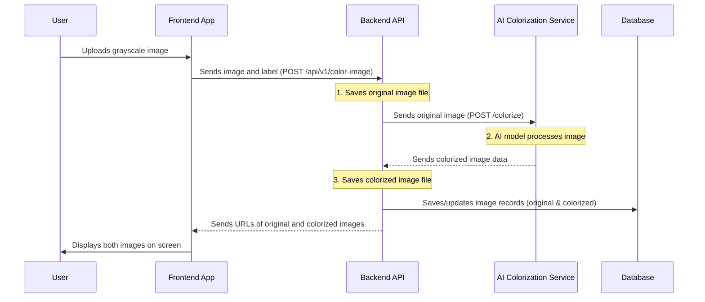

# Chapter 3: Image Colorization Service

Welcome back to the **minor-project** tutorial! In [Chapter 2: User Authentication System](02_user_authentication_system_.md), we learned how our application keeps your data safe by identifying and verifying users. Now that we know *who* is using the app, it's time to dive into *what* they're using it for: the exciting "Image Colorization Service"!

### Why Image Colorization Service Matters

This is the heart of our `minor-project`. Imagine you have an old black-and-white family photo, and you wish you could see it in vibrant colors. That's exactly what this service does! It takes your grayscale (black-and-white) images and magically transforms them into beautiful, full-color versions using the power of Artificial Intelligence (AI).

Think of our application as a digital art studio:

*   You, the user, bring in your black-and-white photo.
*   Our "Image Colorization Service" acts as the **studio manager**. It receives your photo, takes it to a highly specialized **artist** (which is our AI model), tells the artist what to do, waits for the colored version, and then brings it back to you.
*   It also takes care of keeping both your original and the new colorized version safe for you.

Our central use case for this chapter is: **How do we enable users to upload a black-and-white image, send it to an AI for colorization, display both the original and colorized results, and allow them to download the new colored image?** We want to make the process of bringing old photos to life as simple as clicking a button!

Let's explore how we achieve this!

### Key Steps in Image Colorization

The entire process, from your click to seeing the colorized image, involves several key steps:

1.  **Uploading the Image (Frontend):** You select a black-and-white image from your computer.
2.  **Sending to the Backend (Frontend to Backend):** Your selected image is sent securely to our application's server (the "backend").
3.  **Backend Orchestration (Backend):** The backend receives your image, saves it, and then acts as a coordinator, sending the image to our specialized AI "artist."
4.  **AI Transformation (AI Service):** The AI "artist" (our deep learning model) takes the grayscale image and generates a colorized version.
5.  **Saving Results (Backend):** The colorized image is sent back to the backend, which saves it alongside the original.
6.  **Displaying and Downloading (Frontend):** The backend sends the web addresses (URLs) of both images back to your browser, so you can see the results and download the colorized one.

### How You Use It: The Home Page (Frontend)

All the magic for the user happens on the `HomePage`. This is where you'll upload your image and see the results.

#### 1. Choosing and Previewing Your Image

When you visit the `HomePage` (after logging in, thanks to [Chapter 2: User Authentication System](02_user_authentication_system_.md)), you'll see a section to upload an image.

```typescript
// Minor/src/pages/Home.tsx (simplified)
import React, { useState, useRef } from 'react'
import Layout from '../components/Layout'
import { Button } from '../components/button'
import { Upload } from 'lucide-react'

export default function Home() {
  const [selectedImage, setSelectedImage] = useState<File | null>(null)
  const [preview, setPreview] = useState<string | null>(null)
  const fileInputRef = useRef<HTMLInputElement>(null)

  const handleImageUpload = (event: React.ChangeEvent<HTMLInputElement>) => {
    const file = event.target.files?.[0]; // Get the selected file
    if (file) {
      setSelectedImage(file); // Store the file for sending later
      setPreview(URL.createObjectURL(file)); // Create a temporary URL to show a preview
    }
  };
  
  const handleUpload = () => {
    fileInputRef.current?.click(); // Click the hidden file input
  }

  return (
    <Layout>
      <div className="mb-4 flex items-center gap-4">
        <input
          type="file"
          accept="image/*"
          onChange={handleImageUpload}
          className="hidden"
          ref={fileInputRef} // Link to a hidden file input
        />
        <Button variant="outline" onClick={handleUpload}>
          <Upload className="h-4 w-4" /> Choose Image
        </Button>
      </div>
      {preview && (
        <div>
          <h3>Original Image:</h3>
           {/* Display the preview */}
        </div>
      )}
      {/* ... other parts of the page ... */}
    </Layout>
  )
}
```

**Explanation:**

*   `useState<File | null>(null)`: `selectedImage` holds the actual image file you picked, so we can send it to the backend. `preview` holds a temporary web address that points to your selected image, allowing your browser to show it immediately.
*   `useRef<HTMLInputElement>(null)`: This allows us to "click" the hidden file input box when you click our nice `Choose Image` button.
*   `handleImageUpload`: When you pick a file, this function runs. It updates `selectedImage` and creates a `preview` URL so you can see what you've chosen right away.

#### 2. Triggering Colorization

After choosing an image and (optionally) adding a label, you click the "Colorize Image" button.

```typescript
// Minor/src/pages/Home.tsx (simplified)
import { Send } from 'lucide-react'
import { Input } from '../components/component'
import { colorizeImage as colorizeImageApi } from "../utils/api/Colorize" // Our API call function

// ... (inside Home component) ...
const [label, setLabel] = useState<string>('')
const [colorizedImage, setColorizedImage] = useState<string | null>(null) // To store the URL of the colorized image

const colorizeImage = useCallback(async () => {
  if (!selectedImage || !label) {
    toast.error('Please upload an image and enter a label.');
    return;
  }

  // Call the API to colorize the image
  const response = await colorizeImageApi(selectedImage as File, label);
  
  if (response) {
    // Update the preview and colorized image URLs from the response
    setPreview(`${import.meta.env.VITE_IMAGE_URL}${response.original}`);
    setColorizedImage(`${import.meta.env.VITE_IMAGE_URL}${response.colorized}`);
    toast.success(response.message);
  }
}, [selectedImage, label]);

return (
  <Layout>
    <div className="mb-4 flex items-center gap-4">
      {/* ... image upload button ... */}
      <Input
        placeholder="Enter a label"
        value={label}
        onChange={(e) => setLabel(e.target.value)}
      />
      <Button variant="outline" onClick={colorizeImage}>
        <Send className="h-4 w-4" /> Colorize Image
      </Button>
    </div>
    {/* ... preview display ... */}
    {colorizedImage && (
      <div>
        <h3>Colorized Image:</h3>
         {/* Display the colorized image */}
      </div>
    )}
    {/* ... download button (next section) ... */}
  </Layout>
)
```

**Explanation:**

*   `label`: A simple text input for you to give your image a name. This helps with [Chapter 4: Image History Management](04_image_history_management_.md)!
*   `colorizeImage` function: This is the main function triggered by the button.
    *   It first checks if an image and label are provided.
    *   Then, it calls `colorizeImageApi`, which is a helper function to talk to our backend.
    *   Once the backend sends back the URLs for both the original and the new colorized image, `setPreview` and `setColorizedImage` update the display on your screen.

#### 3. Downloading Your Colorized Image

Once the colorized image appears, you'll see a small download icon next to it.

```typescript
// Minor/src/pages/Home.tsx (simplified)
import { Download } from 'lucide-react'
import { downloadImage } from "../utils/api/Colorize" // Our download helper

// ... (inside Home component, within the colorizedImage display block) ...
{colorizedImage && (
  <div>
    <div className="flex justify-between">
      <h3 className="text-lg font-semibold mb-2">Colorized Image:</h3>
      <Button variant="ghost" onClick={()=>downloadImage({imageUrl:colorizedImage, label})}>
        <Download className="h-4 w-4" />
      </Button>
    </div>
    
  </div>
)}
```

**Explanation:**

*   `downloadImage`: This function (from `Colorize.tsx`) takes the `imageUrl` of the colorized picture and its `label`, then tells your browser to download it to your computer with that label as the filename.

### Under the Hood: How Colorization Works

Let's peek behind the curtain to understand how your image travels from your computer, gets colorized, and returns.



#### 1. Frontend Messenger (`Colorize.tsx`)

This file contains the functions our frontend uses to talk to the backend regarding anything image-related.

```typescript
// Minor/src/utils/api/Colorize.tsx (simplified)
import axios from "axios"; // Tool to make network requests
import toast from "react-hot-toast";

export const colorizeImage = async (selectedImage: File, label: string) => {
    try {
        const url = `${import.meta.env.VITE_BASE_URL}/api/v1/color-image`;

        const formData = new FormData(); // Prepare data for file upload
        formData.append("whiteimage", selectedImage); // Add the image file
        formData.append("label", label); // Add the label

        const response = await axios.post(url, formData, {
            withCredentials: true, // Send authentication cookies
            headers: { "Content-Type": "multipart/form-data" }, // Tell backend it's a file upload
        });

        return response.data; // Return the response from the backend
    } catch (error) {
        // ... error handling ...
        return;
    }
};

export const downloadImage = ({imageUrl, label}:{imageUrl:string,label:string}) => {
    fetch(imageUrl)
        .then((res) => res.blob()) // Get the image data as a "blob"
        .then((blob) => {
            const url = window.URL.createObjectURL(new Blob([blob]));
            const link = document.createElement('a'); // Create a hidden link
            link.href = url;
            link.setAttribute('download', `${label}.jpg`); // Set download filename
            document.body.appendChild(link);
            link.click(); // Trigger the download
            link.remove(); // Clean up the link
            toast.success('Image downloaded successfully');
        });
};
```

**Explanation:**

*   `FormData()`: This is a special way to package data, especially when you want to send files (like images) over the internet.
*   `axios.post(url, formData, ...)`: This sends the `formData` (which contains your image and label) to the backend. The `headers` line is crucial because it tells the backend that it's receiving a file upload, not just plain text data.
*   `downloadImage`: This function fetches the image directly from its URL, converts it into a special format (`blob`), and then uses a trick with a hidden link to force the browser to download it.

#### 2. Backend File Handling (`multer.ts`)

When the frontend sends an image, our backend needs a way to receive and temporarily store that file. This is handled by a tool called `multer`.

```typescript
// minor-backend/src/middleware/multer.ts (simplified)
import multer from 'multer';
import path from 'path';

// Where to save files and how to name them
const storage = multer.diskStorage({
    destination: (req, file, cb) => {
        const uploadPath = path.join(__dirname, './../uploads'); // Save to 'uploads' folder
        cb(null, uploadPath);
    },
    filename: (req, file, cb) => {
        // Create a unique name for the file
        const uniqueSuffix = `${Date.now()}-${Math.round(Math.random() * 1e9)}${path.extname(file.originalname)}`;
        cb(null, `${file.fieldname}-${uniqueSuffix}`);
    },
});

const upload = multer({
    storage: storage,
    limits: { fileSize: 2 * 1024 * 1024 }, // Limit file size to 2 MB
    fileFilter: (req, file, cb) => {
        // Only allow image files (JPEG, JPG, PNG, GIF)
        const allowedFileTypes = /jpeg|jpg|png|gif/;
        if (!allowedFileTypes.test(path.extname(file.originalname).toLowerCase())) {
            return cb(new Error("Only JPEG, JPG, PNG, and GIF files are allowed!"));
        }
        cb(null, true);
    },
});

// Middleware function to handle single file upload named 'whiteimage'
const handleUpload = (req, res, next) => {
    upload.single('whiteimage')(req, res, (err) => {
        // ... error handling for file size or type ...
        if (!req.file) { // If no file was uploaded
            return res.status(400).json({ message: 'No valid file uploaded.' });
        }
        next(); // If upload is successful, continue to the next step
    });
};

export default handleUpload;
```

**Explanation:**

*   `multer`: This is like a special delivery person for files uploaded to our server.
*   `storage`: Tells `multer` *where* to save the files (in a folder called `uploads`) and *how* to name them (with a unique timestamp).
*   `limits` and `fileFilter`: These are important for security and performance. They ensure that only image files are uploaded and that they are not too large.
*   `upload.single('whiteimage')`: This line specifically tells `multer` to expect one file named `whiteimage` from the frontend (this matches `formData.append("whiteimage", selectedImage)`).
*   `handleUpload`: This function wraps `multer` and adds error checking, making sure everything went well before passing the request to the next step.

#### 3. Backend Routing (`colorImage.route.ts`)

This file defines the specific web addresses (routes) for our image colorization service on the backend.

```typescript
// minor-backend/src/route/colorImage.route.ts (simplified)
import { Router } from "express";
import { colorImage } from "../controllers/colorImage.controller"; // The main logic
import { authenticate } from "../middleware/authondicate"; // From Chapter 2
import upload from "../middleware/multer"; // Our file upload middleware

const router = Router();

// This route handles image uploads and colorization
router.post('/color-image', authenticate, upload, colorImage);

// ... other image-related routes ...

export default router;
```

**Explanation:**

*   `router.post('/color-image', authenticate, upload, colorImage);`: This line is very important! When the frontend sends a POST request to `/api/v1/color-image`:
    1.  `authenticate`: First, our "bouncer" (from [Chapter 2: User Authentication System](02_user_authentication_system_.md)) checks if you're logged in.
    2.  `upload`: If you are, `multer` (our file handler) processes the uploaded image.
    3.  `colorImage`: Finally, if the image upload is successful, the `colorImage` function (which holds the main logic) takes over.

#### 4. Backend Logic (`colorImage.controller.ts`)

This is where the backend acts as the "studio manager," coordinating the entire colorization process.

```typescript
// minor-backend/src/controllers/colorImage.controller.ts (simplified)
import ColorImage from "../models/ColorImage"; // For original image data in DB
import ColorizedImage from "../models/ColorizedImage"; // For colorized image data in DB
import fs from "fs"; // For file system operations
import path from "path"; // For file path management
import axios from "axios"; // To talk to the AI service

export const colorImage = async (req: Request, res: Response): Promise<void> => {
    const imageName = req?.file?.filename; // Name given by multer
    const userId = req.user?.userId; // Your ID from authentication
    const label = req.body.label; // The label you entered

    try {
        // 1. Save original image info to database
        const originalImageDbEntry = await ColorImage.create({
            userId, imageName, label
        });

        // 2. Send the original image file to the AI Colorization Service (app.py)
        const aiResponse = await axios.post(
            "http://127.0.0.1:3030/colorize", // Address of our AI service
            { 'image': fs.createReadStream(path.join(__dirname, `../uploads/${imageName}`)) },
            {
                headers: { "Content-Type": "multipart/form-data" },
                responseType: "arraybuffer", // Expect binary image data back
            }
        );

        // 3. Save the colorized image received from the AI service
        const colorizedImagePath = path.join(__dirname, `../uploads/${imageName}`).replace(/(\.\w+)?$/, "_colorized.jpg");
        fs.writeFileSync(colorizedImagePath, Buffer.from(aiResponse.data), "binary");
        const colorizedImageName = path.basename(colorizedImagePath);

        // 4. Save colorized image info to database
        await ColorizedImage.create({
            userId,
            coloredImage: colorizedImageName,
            bwImage: originalImageDbEntry._id // Link to original image
        });

        // 5. Send confirmation and image URLs back to the frontend
        res.json({
            message: "Image uploaded and colorized successfully",
            original: imageName,
            colorized: colorizedImageName
        });

    } catch (error) {
        res.status(500).json({ message: "Internal server error" });
    }
};
```

**Explanation:**

*   `req.file.filename`: This is the unique name `multer` gave to your uploaded image file.
*   `ColorImage.create(...)`: This saves a record of your original image (its name, your ID, and the label) in our database.
*   `axios.post("http://127.0.0.1:3030/colorize", ...)`: This is the crucial step where our backend talks to the separate **AI Colorization Service** (which runs on port `3030`). It sends your original image file.
*   `fs.writeFileSync(...)`: Once the AI service sends back the colorized image data, the backend saves it as a new file in the `uploads` folder.
*   `ColorizedImage.create(...)`: A record for the newly colorized image is also saved in the database, linked to its original black-and-white counterpart.
*   `res.json(...)`: Finally, the backend sends back a message and the filenames (which become URLs on the frontend) of both images, so the frontend can display them.

#### 5. The AI Colorization Service (`app.py`)

This is our "specialized artist" – a separate Python application that contains the actual deep learning model. It's solely responsible for taking a grayscale image and spitting out a colorized one.

```python
# app.py (AI Colorization Service - simplified)
import torch
from flask import Flask, request, jsonify, send_file
from PIL import Image
import io
import numpy as np
from skimage.color import rgb2lab, lab2rgb # For color space conversion
# ... import our AI model parts (netG, MainModel) ...

app = Flask(__name__)

# Load the trained AI model (think of this as the artist's brain)
# model = MainModel(...)
# model.load_state_dict(torch.load('model_36.pth'))
# model.eval().to(device)

# Function to prepare image for the AI model
def preprocess_image(image_file_stream):
    test_image = Image.open(image_file_stream).convert("RGB")
    original_size = test_image.size
    test_image = test_image.resize((256, 256), Image.BICUBIC) # Resize for model
    test_image_lab = rgb2lab(np.array(test_image)).astype("float32")
    L = test_image_lab[0:1, ...] / 50. - 1. # Get L channel and normalize
    return torch.from_numpy(L).unsqueeze(0), original_size

# Function to convert AI model output back to a viewable image
def postprocess_image(L, ab_pred, original_size):
    L = L.squeeze(0).cpu().numpy() * 50.0 + 50.0 # Denormalize L
    ab_pred = ab_pred.squeeze(0).cpu().numpy() * 110.0 # Denormalize ab
    predicted_lab = np.concatenate([L[np.newaxis, :, :], ab_pred], axis=0)
    rgb_image = lab2rgb(predicted_lab.transpose(1, 2, 0)) # Convert LAB to RGB
    rgb_image_resized = Image.fromarray((rgb_image * 255).astype(np.uint8)).resize(original_size, Image.BICUBIC)
    return rgb_image_resized

@app.route('/colorize', methods=['POST'])
def colorize():
    if 'image' not in request.files:
        return jsonify({'error': 'No image file found'}), 400

    file = request.files['image'] # Get the image file from the backend API
    
    # Preprocess the image for the AI model
    L_channel, original_size = preprocess_image(file)

    # Use the AI model to predict color (ab channels)
    with torch.no_grad():
        predicted_ab = model.net_G(L_channel.to(device)) # This is the AI doing its magic!

    # Postprocess the result back into a standard image
    output_image = postprocess_image(L_channel, predicted_ab, original_size)

    # Save the colorized image to a temporary buffer and send it back
    img_byte_arr = io.BytesIO()
    output_image.save(img_byte_arr, format='JPEG')
    img_byte_arr.seek(0)
    return send_file(img_byte_arr, mimetype='image/jpeg')

if __name__ == "__main__":
    app.run(host="0.0.0.0", port=3030, debug=True)
```

**Explanation:**

*   **`Flask` App:** This is a small web application specifically designed to run our AI model.
*   **Model Loading:** The code first loads our trained AI model (`model_36.pth`). This model is like a highly skilled painter who has learned how to add colors.
*   `preprocess_image`: The AI model can't just take any image. This function takes the image you uploaded, resizes it, and converts it into a special format (`LAB` color space, specifically the 'L' channel which represents brightness) that the AI model understands.
*   `model.net_G(L_channel)`: This is where the core AI magic happens! The 'L' channel (grayscale) is fed into the AI model, and the model predicts the 'ab' channels (the color information).
*   `postprocess_image`: The AI model's output (color information) is combined with the original 'L' channel, converted back into a standard `RGB` image (what you see on screen), and resized to the original dimensions.
*   `@app.route('/colorize', methods=['POST'])`: This defines the specific address (`/colorize`) that our backend API talks to. When it receives an image, it calls the `colorize` function.
*   `send_file`: Once the image is colorized, this sends the image data back to our backend API.

### Conclusion

In this chapter, we've explored the "Image Colorization Service," the core functionality of our `minor-project`. We saw how our frontend makes it easy to upload an image and how the backend acts as a coordinator, sending the image to our specialized AI "artist" (the Python service) for transformation. We learned about the crucial role of `multer` for handling file uploads and how `axios` facilitates communication between different parts of our application. You now understand the full journey your grayscale image takes to become a vibrant, colorized memory!

Now that we can colorize images, in the next chapter, we'll learn how to keep track of all your colorized masterpieces: [Image History Management](04_image_history_management_.md).

---
