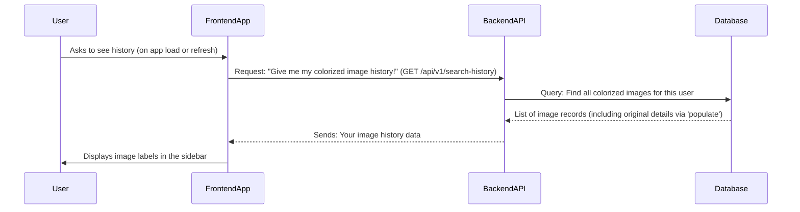
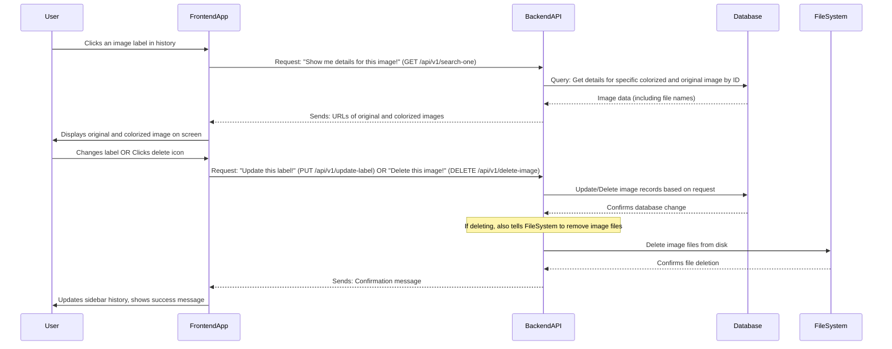

# Chapter 4: Image History Management

Welcome back to the **minor-project** tutorial! In [Chapter 3: Image Colorization Service](03_image_colorization_service_.md), we learned how to bring old black-and-white photos to life with a click. But what happens after you've colorized dozens of images? How do you find that perfect family portrait you colorized last week?

This is where "Image History Management" comes in! Think of it as your personal digital photo album and archive within the app. It keeps a neat record of every image you've transformed, allowing you to easily browse, revisit, and organize your masterpieces.

### Why Image History Matters

Imagine a physical photo album. You can flip through pages, recall memories, and even write notes on them. Our digital history feature provides similar benefits:

*   **Revisit Memories**: Quickly find and view any image you've colorized previously.
*   **Organize**: Update descriptive labels (names) for your images so they're easy to identify.
*   **Manage**: Remove old or unwanted images from your history to keep things tidy.

Our central use case for this chapter is: **How can a user browse their collection of colorized images, view any specific image's original and colorized versions, change its descriptive label, and delete it from their history?** We want to make managing your digital memories simple and intuitive.

Let's dive into how we build this personal archive!

### Key Features of Our Image History

Our image history system offers these main abilities:

1.  **Browsing Past Conversions**: See a list of all your colorized images in the sidebar.
2.  **Viewing Details**: Click on any history item to display its original black-and-white and colorized versions on the main screen.
3.  **Updating Labels**: Give your images meaningful names so you can find them later.
4.  **Deleting Entries**: Remove images you no longer need from your collection.

### How You Use It: The Frontend

All interactions with your image history happen primarily through the **Sidebar** and the **Home Page**.

#### 1. Browsing Your History

The `Sidebar` on the left side of the application (introduced in [Chapter 1: Frontend Application Structure](01_frontend_application_structure_.md)) is where you'll see a list of all your colorized images.

```typescript
// Minor/src/components/Sidebar.tsx (simplified)
import { History, Trash } from 'lucide-react'
import ManageContext from "../utils/context/ManageContext" // To access shared history data

const Sidebar: React.FC<SidebarProps> = ({ isSidebar, setSidebar }) => {
  const { manage, setManage } = useContext(ManageContext) // Get history from shared state

  // Function to set the ID of the selected image
  const handleSetId = ({ id }: { id: string }, {orgId}:{orgId:string}) => {
    setManage({ ...manage, id,orgId }) // Update selected image ID in shared state
  }

  return (
    <div className={`...css classes... ${isSidebar ? 'translate-x-0' : '-translate-x-full'}`}>
      <nav>
        <Button variant="ghost" className="w-full justify-start text-white ...">
          <History className="mr-2 h-4 w-4" /> Your History
        </Button>

        {/* Loop through each item in your history and show a button */}
        {manage.history.map((item, index) => (
          <Button key={index} className="...css classes..." 
            onClick={() => handleSetId({ id: item?._id },{orgId:item?.bwImage?._id})}>
            <span className="text-left truncate w-[35ch] max-w-full">{item?.bwImage?.label}</span>
            <Trash onClick={() => handleDelete({ id: item?.bwImage?._id })} className='w-5 h-5 hover:text-red-700' />
          </Button>
        ))}
        {/* ... close sidebar button ... */}
      </nav>
    </div>
  )
}
```

**Explanation:**

*   `ManageContext`: This is a special tool in React that lets different parts of your app (like the `Sidebar` and `HomePage`) easily share information. Here, it gives the `Sidebar` access to the `history` list. We'll learn more about it shortly.
*   `manage.history.map(...)`: This part goes through each item in your `history` list and creates a clickable button for it.
*   `item?.bwImage?.label`: Each button shows the descriptive `label` you gave to your colorized image.
*   `handleSetId`: When you click one of these history buttons, this function updates the shared `manage` state, telling the app *which* image you've selected. This then triggers the `HomePage` to show that image.

#### 2. Viewing a Specific Image

When you click on an image label in the `Sidebar`, the `HomePage` automatically updates to show you the original black-and-white image and its colorized version, along with its current label.

```typescript
// Minor/src/pages/Home.tsx (simplified)
import ManageContext from '../utils/context/ManageContext' // To get shared history data
import { searchOneHistory, updateLabel } from "../utils/api/Colorize" // Our API calls

export default function Home() {
  // ... (useState declarations for selectedImage, preview, colorizedImage, label) ...
  const { manage, setManage } = React.useContext(ManageContext) // Access shared state

  // Function to fetch and display one history item
  const searchOne = useCallback(async (id: string) => {
    const data = await searchOneHistory(id) // Ask backend for image details
    if (data) {
      // Clear current image and set new ones from history
      setSelectedImage(null) // No new file selected
      setPreview(`${import.meta.env.VITE_IMAGE_URL}${data?.bwImage?.imageName}`)
      setColorizedImage(`${import.meta.env.VITE_IMAGE_URL}${data.coloredImage}`)
      setLabel(data?.bwImage?.label) // Set the label from history
    }
  }, [])

  // When 'manage.id' (the selected image ID) changes, fetch and display it
  useEffect(() => {
    if (manage.id) {
      searchOne(manage.id)
    }
  }, [manage.id, searchOne]) // Re-run when manage.id or searchOne changes

  // ... (other parts like handleImageUpload, colorizeImage) ...

  return (
    <Layout>
      {/* ... image upload and colorize buttons ... */}
      <Input
        placeholder="Enter a label"
        value={label}
        onChange={(e) => setLabel(e.target.value)}
      />
      {/* ... update label button below ... */}
      
      <div className="grid grid-cols-1 md:grid-cols-2 gap-4">
        {preview && ( /* Shows original image */
          <div></div>
        )}
        {colorizedImage && ( /* Shows colorized image */
          <div></div>
        )}
      </div>
      {/* ... no image selected message ... */}
    </Layout>
  )
}
```

**Explanation:**

*   `useEffect(() => { ... }, [manage.id])`: This is a React "hook" that watches for changes in `manage.id`. Whenever you click a new image in the sidebar, `manage.id` changes, and this `useEffect` automatically calls `searchOne` to fetch the details of that specific image.
*   `searchOneHistory(id)`: This is a function (we'll see it in `Colorize.tsx` later) that asks our backend for the original filename, colorized filename, and label for the selected image.
*   `setPreview` and `setColorizedImage`: Once the data comes back from the backend, these update the displayed images and the label input field on the `HomePage`.

#### 3. Updating an Image's Label

If you want to change the name of a colorized image, you can simply type in the input box on the `HomePage` and click "Update Label".

```typescript
// Minor/src/pages/Home.tsx (simplified)
// ... (imports and useState declarations) ...
import { updateLabel as updateLabelApi } from "../utils/api/Colorize" // API call

export default function Home() {
  // ... (previous code for handling image display) ...
  const { manage, historys } = React.useContext(ManageContext) // Need historys to refresh

  const updateLabels = useCallback(async () => {
    if (!label || manage.orgId === '') { // Use orgId to identify original image
      toast.error('Please enter a label and select an image from history.');
      return;
    }
    const response = await updateLabelApi(manage.orgId, label) // Call backend to update
    
    if (response) {    
      setLabel(response.label) // Update label in frontend
      toast.success(response.message)
      historys() // Refresh sidebar history list
    }
  }, [manage.orgId, label, historys]) // Re-run when orgId, label, or historys changes

  return (
    <Layout>
      <div className="mb-4 flex items-center gap-4">
        {/* ... upload/colorize buttons ... */}
        <Input placeholder="Enter a label" value={label} onChange={(e) => setLabel(e.target.value)} />
        {/* Only show "Update Label" if an image from history is selected */}
        {manage.id ? ( // Check if an image from history is displayed
          <Button variant="outline" className="cursor-pointer" onClick={updateLabels}>
            <Send className="sm:mr-2 h-4 w-4" /> <span className='hidden sm:inline-block'>Update Label</span>
          </Button>
        ) : ( // Otherwise, show "Colorize Image"
          <Button variant="outline" className="cursor-pointer" onClick={colorizeImage}>
            <Send className="sm:mr-2 h-4 w-4" /> <span className='hidden sm:inline-block'>Colorize Image</span>
          </Button> 
        )}
      </div>
      {/* ... image display ... */}
    </Layout>
  )
}
```

**Explanation:**

*   `updateLabels` function: This function is called when you click "Update Label."
*   `updateLabelApi(manage.orgId, label)`: It sends the *original image's ID* (`orgId`) and the new `label` to our backend (via `Colorize.tsx`) to update the record in the database. We use `orgId` because the label is actually stored with the *original* black-and-white image record.
*   `historys()`: After a successful update, we call `historys()` (a function from `ManageContext`) to tell the sidebar to refresh its list, so you see the new label immediately.

#### 4. Deleting an Image

To remove an image from your history, simply click the trash can icon next to its label in the `Sidebar`.

```typescript
// Minor/src/components/Sidebar.tsx (simplified)
import { Trash } from 'lucide-react'
import { deleteHistory as deleteHistoryApi } from '../utils/api/Colorize' // Our API call
import ManageContext from "../utils/context/ManageContext"

const Sidebar: React.FC<SidebarProps> = ({ isSidebar, setSidebar }) => {
  const { manage, setManage } = useContext(ManageContext) // Access shared state

  // Handle deletion of an item
  const handleDelete = async ({ id }: { id: string }) => {
    const data = await deleteHistoryApi(id) // Call backend to delete
    if (data) {
      // Remove the deleted item from the context history state directly
      setManage(prevManage => ({
        ...prevManage,
        history: prevManage.history.filter(item => item?.bwImage?._id !== id)
      }))
      toast.success(data.message) // Show success message
    }
  }

  return (
    <div className={`...css classes...`}>
      <nav>
        {/* ... "Your History" button ... */}
        {manage.history.map((item, index) => (
          <Button key={index} className="...css classes..." 
            onClick={() => handleSetId({ id: item?._id },{orgId:item?.bwImage?._id})}>
            <span className="...">{item?.bwImage?.label}</span>
            <Trash onClick={() => handleDelete({ id: item?.bwImage?._id })} className='w-5 h-5 hover:text-red-700 z-50' />
          </Button>
        ))}
        {/* ... close sidebar button ... */}
      </nav>
    </div>
  )
}
```

**Explanation:**

*   `handleDelete`: This function is called when you click the `Trash` icon.
*   `deleteHistoryApi(id)`: It sends the *original image's ID* (`id`) to our backend (via `Colorize.tsx`).
*   `setManage(prevManage => ({ ... }))`: After the backend confirms deletion, this clever line updates the `history` list in our shared `ManageContext`, instantly removing the deleted item from the sidebar without needing a full page refresh.

### Under the Hood: How Image History is Managed

Let's look at how the frontend and backend work together to manage your image history.

#### 1. Retrieving Your Image History

When you open the application, it automatically fetches your history. When you explicitly click on a history item, it fetches its specific details.



#### 2. Managing a History Item (Viewing, Updating, Deleting)

Once an item is in the history, you can interact with it further.



#### 3. Frontend Data Sharing (`ManageContext.tsx`)

As mentioned, we use a React Context called `ManageContext` to allow the `Sidebar` and `HomePage` to talk to each other about which image is currently selected and to keep the history list up-to-date.

```typescript
// Minor/src/utils/context/ManageContext.tsx
import React, { createContext, useState, ReactNode } from 'react';

// Defines what kind of data our context will hold
interface ManageContextType {
  manage: {
    history: any[]; // Stores the list of history items
    id: string; // ID of the currently selected colorized image (from history)
    orgId: string; // ID of the original black-and-white image
  };
  setManage: React.Dispatch<React.SetStateAction<ManageContextType['manage']>>;
  historys: () => void; // Function to refresh history
}

// Create the actual context with default (empty) values
const ManageContext = createContext<ManageContextType>({
  manage: { history: [], id: '', orgId: '' },
  setManage: () => {},
  historys: () => {}, // Provide a dummy function for default
});

// This component wraps parts of our app that need access to the context
export const ManageProvider: React.FC<{ children: ReactNode }> = ({ children }) => {
  const [manage, setManage] = useState({ history: [], id: '', orgId: '' });

  // This function will be passed down to refresh history
  const historys = async () => { /* calls colorizeHistory from api */ }; 

  return (
    <ManageContext.Provider value={{ manage, setManage, historys }}>
      {children} {/* Any components inside ManageProvider can now use this context */}
    </ManageContext.Provider>
  );
};

export default ManageContext;
```

**Explanation:**

*   `createContext`: This sets up a "channel" for data to be shared.
*   `ManageProvider`: This component wraps around other components in our application. Any component *inside* `ManageProvider` can then "subscribe" to the `ManageContext` to get or update the `manage` state.
*   `useState({ history: [], id: '', orgId: '' })`: This holds the `history` array (the list of all colorized images), `id` (the ID of the *colorized* image currently displayed), and `orgId` (the ID of the *original* black-and-white image, needed for updating labels and deleting).

#### 4. Frontend API Calls (`Colorize.tsx`)

The `Colorize.tsx` file (which we've seen before for the actual colorization) also handles communication for history management.

```typescript
// Minor/src/utils/api/Colorize.tsx (simplified)
import axios from "axios";
import toast from "react-hot-toast";

export const colorizeHistory = async () => { // Fetches all colorized images for user
    const url = `${import.meta.env.VITE_BASE_URL}/api/v1/search-history`;
    const response = await axios.get(url, { withCredentials: true });
    return response.data.data;
};

export const searchOneHistory = async (id: string) => { // Fetches details for one image
    const url = `${import.meta.env.VITE_BASE_URL}/api/v1/search-one/${id}`;
    const response = await axios.get(url, { withCredentials: true });
    if(response.data.status === 404){ toast.error(response.data.message); return; }
    return response.data.data;
};

export const updateLabel = async (id: string, label: string) => { // Updates image label
    const url = `${import.meta.env.VITE_BASE_URL}/api/v1/update-label/${id}`;
    const response = await axios.put(url, { label }, { withCredentials: true });
    toast.success(response.data.message);
    return response.data;
};

export const deleteHistory = async (id: string) => { // Deletes image records and files
    const url = `${import.meta.env.VITE_BASE_URL}/api/v1/delete-image/${id}`;
    const response = await axios.delete(url, { withCredentials: true });     
    toast.success(response.data.message);
    return response.data;
};
```

**Explanation:**

*   These functions use `axios` to send specific requests (GET, PUT, DELETE) to our backend, retrieving or modifying history data.
*   `withCredentials: true`: This is vital as it ensures your login `token` (from [Chapter 2: User Authentication System](02_user_authentication_system_.md)) is sent with each request, so the backend knows *who* you are.

#### 5. Backend Routes (`colorImage.route.ts`)

These are the backend "addresses" that the frontend uses for history management.

```typescript
// minor-backend/src/route/colorImage.route.ts (simplified)
import { Router } from "express";
import { colorImage, deleteImages, searchHistory, updateLabel, searchOne } from "../controllers/colorImage.controller";
import { authenticate } from "../middleware/authondicate"; // Our authentication check
import upload from "../middleware/multer"; // For file uploads

const router = Router();

// Routes for image history management
router.get('/search-history', authenticate, searchHistory); // Get all history
router.get('/search-one/:id', authenticate, searchOne); // Get one history item by ID
router.put('/update-label/:id', authenticate, updateLabel); // Update label by ID
router.delete('/delete-image/:id', authenticate, deleteImages); // Delete by ID

// ... other routes like '/color-image' ...

export default router;
```

**Explanation:**

*   Each line defines a specific action. For example, `router.get('/search-history', ...)` means that when the frontend sends a GET request to `/api/v1/search-history`, the `authenticate` middleware runs first (to check if you're logged in), and then the `searchHistory` function in our controller takes over.

#### 6. Backend Logic (`colorImage.controller.ts`)

This is where the backend retrieves, updates, and deletes image records and their associated files.

```typescript
// minor-backend/src/controllers/colorImage.controller.ts (simplified)
import ColorImage from "../models/ColorImage" // Our original image model
import ColorizedImage from "../models/ColorizedImage"; // Our colorized image model
import fs from "fs"; // For deleting files
import path from "path"; // For file paths
import { Request, Response } from "express";

export const searchHistory = async (req: Request, res: Response): Promise<void> => {
    const userId = req.user?.userId; // Get user ID from authenticated request
    const colorizedImages = await ColorizedImage.find({ userId }).populate("bwImage"); // Find all colorized images and link to originals
    if(!colorizedImages || colorizedImages.length === 0) { res.status(404); return; }
    res.json({ data: colorizedImages }); // Send history back
};

export const searchOne = async (req: Request, res: Response): Promise<void> => {
    const userId = req.user?.userId;
    const { id } = req.params; // ID of the colorized image record
    const colorizedImage = await ColorizedImage.findOne({ userId, _id: id }).populate("bwImage"); // Find and link
    if (!colorizedImage) { res.status(404).json({ message: "Image not found" }); return; }
    res.json({ data: colorizedImage }); // Send details of one image
};

export const updateLabel = async (req: Request, res: Response): Promise<void> => {
    const userId = req.user?.userId;
    const { id } = req.params; // ID of the original image record
    const { label } = req.body;
    const colorImage = await ColorImage.findOneAndUpdate({ userId, _id: id }, { label }, { new: true }); // Update original image's label
    if (!colorImage) { res.status(404).json({ message: "Image not found" }); return; }
    res.json({ message: "Label updated successfully", data: colorImage });
};

export const deleteImages = async (req: Request, res: Response): Promise<void> => {
    const userId = req.user?.userId;
    const { id } = req.params; // ID of the original image record
    const bwImage = await ColorImage.findById({ userId, _id: id }); // Find original
    const colorizedImage = await ColorizedImage.findOne({ userId, bwImage: bwImage?._id }); // Find colorized
    if (!bwImage || !colorizedImage) { res.status(404).json({ message: "Image not found" }); return; }

    fs.unlinkSync(path.join(__dirname, `../uploads/${bwImage.imageName}`)); // Delete original file
    fs.unlinkSync(path.join(__dirname, `../uploads/${colorizedImage.coloredImage}`)); // Delete colorized file

    await ColorImage.findByIdAndDelete(bwImage._id); // Delete original record
    await ColorizedImage.findByIdAndDelete(colorizedImage._id); // Delete colorized record
    res.json({ message: "Both images deleted successfully" });
};
```

**Explanation:**

*   `req.user?.userId`: This is how the backend knows which user is logged in, thanks to the `authenticate` middleware (from [Chapter 2: User Authentication System](02_user_authentication_system_.md)).
*   `ColorizedImage.find({ userId }).populate("bwImage")`: This line is powerful! It tells our database to find all `ColorizedImage` entries belonging to the user and, for each one, also fetch the linked `bwImage` (original image) details. This allows us to get the `label` and original filename easily.
*   `findOneAndUpdate` and `findByIdAndDelete`: These are commands to find and update, or find and delete, records in our database.
*   `fs.unlinkSync(...)`: This is a Node.js command that physically deletes the image files (both original and colorized) from the server's `uploads` folder.

#### 7. Database Models (`ColorImage.ts` and `ColorizedImage.ts`)

To store the image information, we use two separate "models" in our database, which are blueprints for our data.

```typescript
// minor-backend/src/models/ColorImage.ts (for original B&W images)
import mongoose from "mongoose";

const ColorImageSchema = new mongoose.Schema({
    userId :{ type: mongoose.Schema.Types.ObjectId, ref: 'User', required: true },
    imageName: { type: String, required: true }, // The filename of the B&W image
    label: { type: String, required: true }, // The user-given label
}, {timestamps: true});

const ColorImage = mongoose.model("colorImage", ColorImageSchema);
export default ColorImage;

// minor-backend/src/models/ColorizedImage.ts (for colorized images)
import mongoose from "mongoose";

const ColorizedImageSchema = new mongoose.Schema({
    userId :{ type: mongoose.Schema.Types.ObjectId, ref: 'User', required: true },
    coloredImage: { type: String, required: true }, // The filename of the colorized image
    bwImage: { // A link (reference) to the original B&W image in ColorImage collection
        type: mongoose.Schema.Types.ObjectId,
        required: true,
        ref: 'colorImage' 
    },
}, {timestamps: true});

const ColorizedImage = mongoose.model("colorizedImage", ColorizedImageSchema);
export default ColorizedImage;
```

**Explanation:**

*   `ColorImageSchema`: Stores details about the *original black-and-white* image, including the user's ID, its filename, and the `label` provided by the user.
*   `ColorizedImageSchema`: Stores details about the *colorized* version. Critically, it has a `bwImage` field that uses `ref: 'colorImage'` to create a link to its original black-and-white counterpart. This link is what allows `populate` (seen in `searchHistory` and `searchOne` functions) to easily pull information from both records when needed.

### Conclusion

In this chapter, we've explored "Image History Management," transforming our `minor-project` into a true digital photo album. We learned how the `Sidebar` lists your colorized images, how clicking an item dynamically updates the `HomePage` with its details, and how you can update labels or delete entries. You now understand how the frontend leverages `ManageContext` for data sharing and how the backend handles these requests, retrieving data from the database, updating records, and even deleting files from the server.

Now that you can manage your colorized memories, in the next chapter, we'll dive into the core intelligence behind the magic: the [Deep Learning Colorization Model](05_deep_learning_colorization_model_.md) itself!

---
