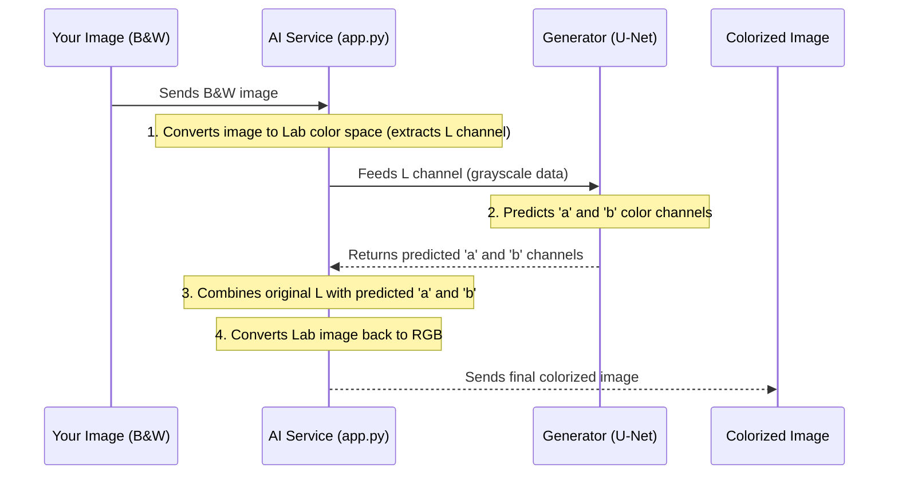

# Chapter 5: Deep Learning Colorization Model

Welcome back to the **minor-project** tutorial! In [Chapter 4: Image History Management](04_image_history_management_.md), we learned how to keep track of all your vibrant, colorized photos. But how did those black-and-white photos get their colors in the first place? That's the real magic we're about to uncover in this chapter: the "Deep Learning Colorization Model."

### Why the Deep Learning Model Matters

This is the brain, the artist, and the secret sauce behind our entire `minor-project` application. Without it, your black-and-white photos would just... stay black and white! This model is an **Artificial Intelligence (AI)** engine specially trained to understand colors.

Imagine hiring a highly skilled painter who has studied millions of colored photos. You give them an old black-and-white picture, and after a moment, they hand it back to you, perfectly colorized. Our Deep Learning Colorization Model is exactly that: a specialized digital painter that can accurately guess and apply colors to any black-and-white photograph.

Our central use case for this chapter is: **How does our application's AI take a grayscale (black-and-white) image and generate a realistic, full-color version of it?** We want to understand the core intelligence that makes the colorization happen.

Let's break down how this incredible AI works!

### Key Concepts of Our Colorization Model

The heart of our colorization magic involves a few important ideas:

1.  **Artificial Intelligence (AI) & Deep Learning**: These are computer systems that can learn from data. Deep Learning uses special structures called "neural networks" (inspired by the human brain) to learn incredibly complex patterns, like how to add colors.
2.  **Color Spaces (RGB vs. Lab)**:
    *   **RGB (Red, Green, Blue)**: This is how most images are stored and displayed (like on your screen). It's great for showing colors.
    *   **Lab Color Space**: This is a different way to describe colors, and it's perfect for our AI!
        *   **L channel**: Represents **L**ightness (how bright or dark something is). This is essentially your black-and-white image.
        *   **a channel**: Represents the color spectrum from green to red.
        *   **b channel**: Represents the color spectrum from blue to yellow.
    By separating lightness from color, our AI can focus on *just* predicting the color (a and b) given the lightness (L). It's easier for the AI to learn!
3.  **Generator (The Painter - a U-Net)**: This is the main part of our AI. It takes your grayscale (L channel) image as input and tries to *generate* (predict) the missing 'a' and 'b' color channels. It's built using a specific type of neural network called a **U-Net**, which is excellent at image-to-image translations. Think of it as the painter adding colors.
4.  **Discriminator (The Art Critic)**: While the Generator learns to paint, the Discriminator is like an art critic. It looks at the colorized image produced by the Generator and tries to decide if it looks like a "real" photograph (one it has seen during training) or a "fake" (one generated by the AI). This "critic" helps push the "painter" to create more realistic and convincing colors.
5.  **Generative Adversarial Networks (GANs)**: The Generator and Discriminator work together in a clever game called a GAN. The Generator tries to fool the Discriminator into thinking its colorizations are real, and the Discriminator tries to get better at spotting fakes. This constant "competition" makes both parts of the AI better over time, leading to amazing colorization results!

### How the Model Works (Simplified Flow)

When you upload a black-and-white image for colorization, here's a high-level overview of what happens inside the AI:



### Under the Hood: The AI Model's Code

Let's look at the key parts of the Python code that make this deep learning model run. This code lives in the `model` folder of your project, especially in `app.py` (the AI service) and `model.py` (the definitions of the Generator and Discriminator).

#### 1. The AI Service (`app.py`)

This `app.py` file is a small web service that acts as the "receptionist" for our AI. It receives the black-and-white image, prepares it for the model, uses the model to colorize, and then prepares the result to be sent back.

**Loading the AI Brain:**
First, the `app.py` needs to load the trained AI model. Think of this as the painter getting ready with their brushes and knowing their craft.

```python
# model/app.py (simplified)
import torch
from flask import Flask
from model import MainModel, build_res_unet # Our model definitions

app = Flask(__name__)

# Load the generator model structure (the painter's skeleton)
netG = build_res_unet()
netG.load_state_dict(torch.load('GeneratorModel.pth', weights_only=True))

# Load the full trained model (the painter's learned skills)
device = torch.device("cuda" if torch.cuda.is_available() else "cpu")
model = MainModel(netG)
model.load_state_dict(torch.load('final_model_with_gen.pth', weights_only=True))
model.eval() # Set model to evaluation mode (no more learning)
model.to(device) # Move model to GPU if available
```
**Explanation:**
*   `Flask` is used to create a simple web server that listens for image requests.
*   `netG` and `model`: These lines load the pre-trained "brains" of our AI. `GeneratorModel.pth` and `final_model_with_gen.pth` are files that contain all the learned knowledge (like millions of tiny adjustments) that allow the AI to colorize.
*   `model.eval()`: This tells the model to stop "learning" and just focus on making predictions.
*   `model.to(device)`: This moves the model to your computer's GPU (if you have one) for faster processing.

**Preparing the Image (`preprocess_image`):**
The AI model needs its input in a very specific format. This function takes your uploaded image, resizes it, and converts it to the 'L' channel of the Lab color space.

```python
# model/app.py (simplified)
from PIL import Image
import numpy as np
from skimage.color import rgb2lab

def preprocess_image(image_file_stream):
    test_image = Image.open(image_file_stream).convert("RGB")
    original_size = test_image.size
    test_image = test_image.resize((256, 256), Image.BICUBIC) # Resize for model
    test_image_lab = rgb2lab(np.array(test_image)).astype("float32")
    L = test_image_lab[0:1, ...] / 50. - 1. # Get L channel and normalize
    return torch.from_numpy(L).unsqueeze(0), original_size
```
**Explanation:**
*   `Image.open().convert("RGB")`: Opens the image and ensures it's in the standard RGB format.
*   `resize((256, 256))`: Our AI model is trained on 256x256 pixel images, so we resize the input image to match this.
*   `rgb2lab(np.array(test_image))`: Converts the RGB image into the Lab color space.
*   `L = test_image_lab[0:1, ...] / 50. - 1.`: Extracts *only* the L channel (brightness) and normalizes its values. This normalized L channel is the only thing the Generator sees!

**The Colorization Request (`/colorize` endpoint):**
This is the part of the service that receives the image from our backend API (as seen in [Chapter 3: Image Colorization Service](03_image_colorization_service_.md)).

```python
# model/app.py (simplified)
from flask import request, jsonify, send_file
import io

@app.route('/colorize', methods=['POST'])
def colorize():
    if 'image' not in request.files:
        return jsonify({'error': 'No image file found'}), 400

    file = request.files['image'] # Get image from request
    L_channel, original_size = preprocess_image(file) # Prepare it

    # This is the AI doing its magic!
    with torch.no_grad():
        predicted_ab = model.net_G(L_channel.to(device))

    output_image = postprocess_image(L_channel, predicted_ab, original_size) # Reconstruct image

    # Save to a temporary buffer and send it back
    img_byte_arr = io.BytesIO()
    output_image.save(img_byte_arr, format='JPEG')
    img_byte_arr.seek(0)
    return send_file(img_byte_arr, mimetype='image/jpeg')
```
**Explanation:**
*   `request.files['image']`: Retrieves the image file sent by the backend.
*   `L_channel, original_size = preprocess_image(file)`: Calls our function to prepare the image.
*   `predicted_ab = model.net_G(L_channel.to(device))`: This is the **core colorization step**! The `L_channel` (grayscale) is fed into `model.net_G` (our Generator/painter), and it predicts the corresponding `ab` color channels.
*   `output_image = postprocess_image(...)`: After the prediction, this function takes the original `L` channel and the newly predicted `ab` channels, combines them, converts them back to the RGB format your screen understands, and resizes the image back to its original dimensions.
*   `send_file`: Sends the final colorized image data back to the backend.

#### 2. The Deep Learning Model Definitions (`model.py`)

This file contains the blueprints for our AI model's components: the Generator (U-Net) and the Discriminator.

**The Generator (U-Net - `build_res_unet`):**
The Generator is built using a special network structure called a **U-Net**. Imagine it like a funnel that compresses the image information down, and then an inverse funnel that expands it back up, adding details along the way. This "U" shape helps it to understand both big picture elements and fine details.

```python
# model/model.py (simplified)
import torch.nn as nn
from fastai.vision.learner import create_body
from torchvision.models import resnet18
from fastai.vision.models.unet import DynamicUnet

def build_res_unet(n_input=1, n_output=2, size=256):
    restnet_model = resnet18(weights=None) # Start with a ResNet-like base
    device = torch.device("cuda" if torch.cuda.is_available() else "cpu")
    body = create_body(restnet_model, n_in=n_input, cut=-2)
    # DynamicUnet creates the U-Net structure
    net_G = DynamicUnet(body, n_output, (size, size)).to(device)
    return net_G
```
**Explanation:**
*   `build_res_unet`: This function constructs our Generator.
*   `resnet18`: A popular base network often used in image tasks. Think of it as providing a good starting point for the "funnel" part of our U-Net.
*   `DynamicUnet`: This is the special structure that takes the compressed information from `resnet18` and then learns to expand it back, predicting the two color channels (`n_output=2`, for 'a' and 'b').
*   **Input**: This Generator takes the single 'L' channel (grayscale) as its input (`n_input=1`).
*   **Output**: It predicts the two color channels 'a' and 'b' (`n_output=2`).

**The Discriminator (`PatchDiscriminator`):**
The Discriminator's job is to act as the "art critic." It doesn't generate images; instead, it looks at images and tries to decide if they are "real" (from the original training data) or "fake" (generated by our U-Net painter).

```python
# model/model.py (simplified)
class PatchDiscriminator(nn.Module):
    def __init__(self, input_c, num_filters=64, n_down=3):
        super().__init__()
        # This creates a series of layers that analyze parts of the image
        model = [self.get_layers(input_c, num_filters, norm=False)]
        model += [self.get_layers(num_filters * 2 ** i, num_filters * 2 ** (i + 1), s=2) 
                          for i in range(n_down)]
        model += [self.get_layers(num_filters * 2 ** n_down, 1, s=1, norm=False, act=False)] 
        self.model = nn.Sequential(*model)                                                   
        
    def get_layers(self, ni, nf, k=4, s=2, p=1, norm=True, act=True): 
        # Helper to build convolutional layers
        layers = [nn.Conv2d(ni, nf, k, s, p, bias=not norm)]          
        if norm: layers += [nn.BatchNorm2d(nf)]
        if act: layers += [nn.LeakyReLU(0.2, True)]
        return nn.Sequential(*layers)
    
    def forward(self, x):
        # Passes the image through its layers to get a "real" or "fake" score
        return self.model(x)
```
**Explanation:**
*   **Input**: The Discriminator takes a full color image (L + a + b channels, so `input_c=3`).
*   **Output**: It outputs a "score" for different patches (parts) of the image, indicating how "real" it thinks each patch is. These scores are then combined to decide if the whole image looks real or fake.
*   It's composed of several `Conv2d` layers, which are good at finding patterns in images.

**The Main Model (`MainModel`):**
This class brings the Generator and Discriminator together. During the training phase (which is already done when you use the app), this model orchestrates the "game" where the Generator tries to create realistic colors and the Discriminator tries to spot them. For *using* the model in our app, we primarily interact with its `net_G` (the Generator).

```python
# model/model.py (simplified)
class MainModel(nn.Module):
    def __init__(self, net_G=None, lr_G=2e-4, lr_D=2e-4, lambda_L1=100.):
        super().__init__()
        
        self.device = torch.device("cuda" if torch.cuda.is_available() else "cpu")
        self.lambda_L1 = lambda_L1 # Used during training
        
        if net_G is None: # If no generator provided, create a default one
            self.net_G = Unet(input_c=1, output_c=2, n_down=8, num_filters=64).to(self.device)
        else: # Otherwise, use the one passed in (our pre-loaded netG)
            self.net_G = net_G.to(self.device)
            
        # Initialize the Discriminator (the critic)
        self.net_D = PatchDiscriminator(input_c=3, n_down=3, num_filters=64).to(self.device)
        
        # Define how to measure "loss" (how bad the predictions are)
        self.GANcriterion = GANLoss(gan_mode='vanilla').to(self.device) # For Discriminator
        self.L1criterion = nn.L1Loss() # For Generator (to ensure colors are close to real ones)
        
        # Set up optimizers (how the models learn and adjust)
        self.opt_G = optim.Adam(self.net_G.parameters(), lr=lr_G)
        self.opt_D = optim.Adam(self.net_D.parameters(), lr=lr_D)
    
    def forward(self, x):
        # When you call model(image), it just passes it to the Generator
        return self.net_G(x)
```
**Explanation:**
*   `self.net_G`: This is our painter (the U-Net Generator).
*   `self.net_D`: This is our art critic (the Patch Discriminator).
*   `GANcriterion` and `L1criterion`: These define how the AI measures how well it's doing during training. The `L1Loss` tries to make the generated colors very close to the *actual* colors from the training data, while `GANLoss` focuses on making them *look* real enough to fool the Discriminator.
*   `opt_G` and `opt_D`: These are the "optimizers" that help the Generator and Discriminator learn and improve their skills over time.
*   `forward(self, x)`: When the AI service calls `model(L_channel)`, this method is triggered, and it simply passes the grayscale `x` (the L channel) to the `net_G` (the Generator) to get the color prediction.

### Conclusion

In this final chapter, we've explored the "Deep Learning Colorization Model," the intelligence that truly powers our `minor-project`. We dived into key concepts like Lab color space, the Generator (our U-Net painter), and the Discriminator (our art critic), understanding how they work together in a GAN setup to bring colors to old black-and-white images. We saw how the AI service preprocesses images, makes predictions, and then reconstructs the vibrant results.

You now have a complete understanding of the `minor-project` application, from its user interface and secure authentication to its core image colorization service, history management, and the sophisticated deep learning model at its heart. We hope you've enjoyed this journey into building a powerful and magical image colorization tool!

---
