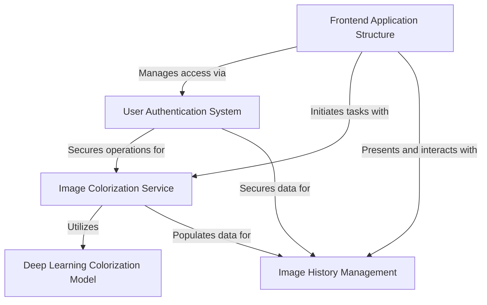

# Tutorial: minor-project

The `minor-project` is an application designed to **colorize grayscale images** using advanced artificial intelligence. It provides a user-friendly interface where individuals can `upload their black-and-white photos` and retrieve *vibrantly colored versions*. Key features include `secure user authentication`, *personal image history management* to track past conversions, and a powerful `deep learning model` that performs the actual colorization.

## Visual Overview

## Chapters

1. [Frontend Application Structure
](01_frontend_application_structure_.md)
2. [User Authentication System
](02_user_authentication_system_.md)
3. [Image Colorization Service
](03_image_colorization_service_.md)
4. [Image History Management
](04_image_history_management_.md)
5. [Deep Learning Colorization Model
](05_deep_learning_colorization_model_.md)
